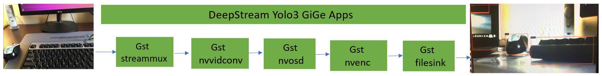
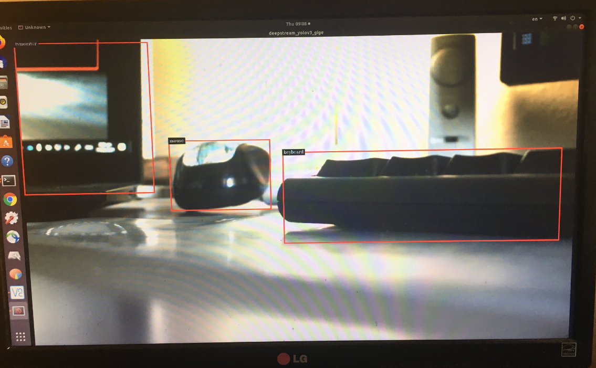

*****************************************************************************
* SPDX-License-Identifier: NVIDIA Corporation
* Copyright (c) 2019-2022.  All rights reserved.
*
* NVIDIA Corporation and its licensors retain all intellectual property
* and proprietary rights in and to this software, related documentation
* and any modifications thereto.  Any use, reproduction, disclosure or
* distribution of this software and related documentation without an express
* license agreement from NVIDIA Corporation is strictly prohibited.
* 
*****************************************************************************
# Introduction

This deepstream-yolo3-gige application uses the Nvidia DeepStream-5.1 SDK
to generate video or display on screen after object detection.

This apps uses the Basler acA1920-25gc GigE camera (ethernet port) with the ARAVIS SDK [1] as the plugin.
Also it takes advantages of Nvidia DeepStream-5.1 SDK with the Yolo3 Libraries for quick DS-5.1 application. 

With the GigE camera in place, this application idea can be extended into many applications, such as the 
highway trafic follow monitoring, industrial production line for quality control, supermarket safety control, etc. 

# What is ARAVIS?

Aravis is a glib/gobject based library for video acquisition using Genicam cameras. It currently implements the 
gigabit ethernet and USB3 protocols used by the industrial cameras. It also provides a basic ethernet camera simulator
and simple video viewer[1]. License requirement is under GNU General Public License, Version 2

# How to Install ARAVIS?

download the aravis-0.6.0 (this version works for this apps at least) and put it in /src dir. as example. One can try the latest version as well.

* cd aravis-0.6.0  
* ./configure --enable-viewer --prefix=/usr  
* make  
* make install  
* After get libgstaravis-0.6.so, one need to copy that file into /usr/lib/x86_64-linux-gnu for dGPU  
for Jetson devices, for example of Jetson NX, copy that file into /usr/lib/aarch64-linux-gnu  

# Prerequisites:

Please follow instructions in the apps/sample_apps/deepstream-app/README on how
to install the prerequisites for Deepstream SDK, the DeepStream SDK itself and the
apps.

One must have the following development packages installed
  *  GStreamer-1.0  
  *  GStreamer-1.0 Base Plugins  
  *  GStreamer-1.0 gstrtspserver  
  *  X11 client-side library  
  *  DeepStream-5.1 SDK : https://docs.nvidia.com/metropolis/deepstream/dev-guide/index.html
  *  Install aravis-0.6.0[1] - this is in GNU General Public License, Version 2

# DeepStream Pipeline 
  * DeepStream SDK is based on the GStreamer framework. GStreamer is a pipeline based multimedia framework that links together a wide variety of media processing systems to complete workflows. Following is the pipleline for this Yolo3 GiGE application which is based on the DL Yolo3 network for the Object Dectection. 

# This DeepStream Yolo3 GigE Apps Overview

  * This application takes advantages of Nvidia DeepStream-5.1 SDK on the Yolo3 Object Detection Libraries - no training needed

  * Nvidia Transfer Learning Toolkit 3.0 can be used for the re-train if one needs to use different dataset

  * The ARAVIS SDK and Basler GigE camera will be used for this application

  * Using TLT converter to generate the TRT engine file for the DeepStream Deployment for the Yolo3 GigE application if need re-train

  * User can make selection: either display the bounding box of object detection on screen or save as a encoded H264 video file

    

# How to Compile the Application Package
  * git clone this application into /opt/nvidia/deeepstream/deepstream-5.1/sources/apps/sample_apps

  * $ cd deepstream-yolov3-gige

  * $ make

  * For Jetson edge device, e.g, Xavier NX, one need to use  "nvbuf-memory-type", 1 in deepstream-yolov3-gige-jetson.c to replace: "nvbuf-memory-type", 3 which is fit for dPGU use

# How to Run this DeepStream Yolo3 GiGE Application 

  * $ example: sudo ./deepstream_yolov3_gige  -- object detection results will be displayed on screen only

  * $ example: sudo ./deepstream_yolov3_gige out.h264 -- produce the video output file which is in encoded H264 format.  

  * Example picture from the object detection result

 

 
 # Nvidia Transfer Learning Toolkit 3.0 for Re-Training, Evaluation, Export, and Quick Deployment  

  * TLT Converter Information (include how to download) : https://developer.nvidia.com/tlt-get-started

  * Use Nvidia TLT 3.0 for Re-Training, Evaluation, Export, and Quick Deployment 

  * Use the TLT to generate the .etlt and .engine file for the DeepStream application deployment after retraining

  * One can refer to Jupyter Notebook (yolo_v3.ipynb) for Yolo3 training based on the new dataset used

  * Refer to default_spec as the configuration file used by the Jupyter Notebook for the training, evaluation, and export

  * Use the Jupyter Notebook to download the resenet_18 for yolov3 from Nvidia GPU Cloud : https://ngc.nvidia.com/

 
  ## The information for Nvidia Transfer Learning Toolkit 3.0 User Guide for Yolo3
  
   * https://docs.nvidia.com/metropolis/TLT/tlt-user-guide/text/object_detection/yolo_v3.html

# Quickly Deploying the Apps to DeepStream-5.1 Using Transfer Learning Toolkit-3.0  

  * Use the .etlt or .engine file after TLT train, export, and coverter

  * Use the Jetson version of the tlt converter to generate the .engine file used in the Jetson devices

    example: ./tlt-converter -k $key -e trt.fp16.engine -t fp16 -p input_1 1,1x3x600x600, 4x3x600x600,16x3x600x600 frcnn_kitti_resnet50_retrain_fp16.etlt  
    here: $key is the key when do the tlt train and 600x600 is the input/training image size as example

  * Define the .etlt or .engine file path in the config file for dGPU and Jetson for the DS-5.1 application

  * example:  model-engine-file = trt.int8.engine in config_infer_primary_yoloV3.txt

  * The performance using different GPU devices

  
  

# References

  * [1] ARAVIS SDK: https://github.com/AravisProject/aravis

 

